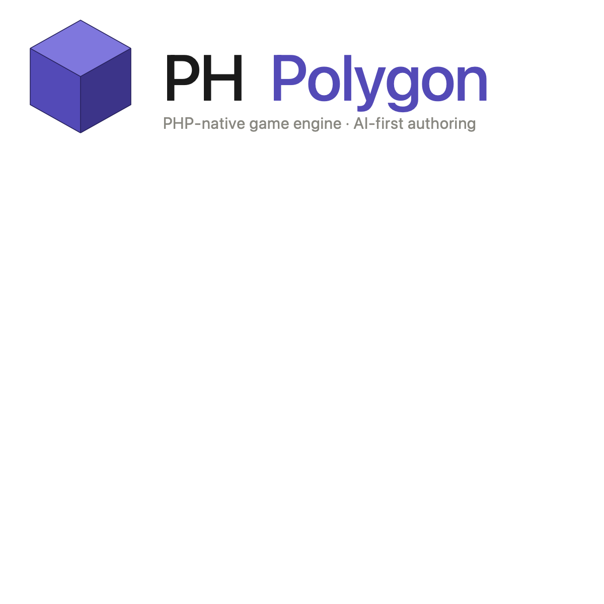
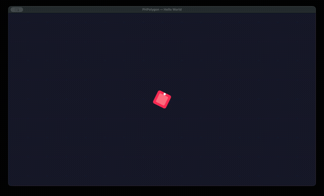
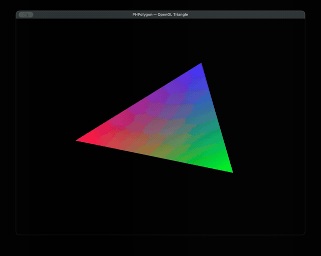
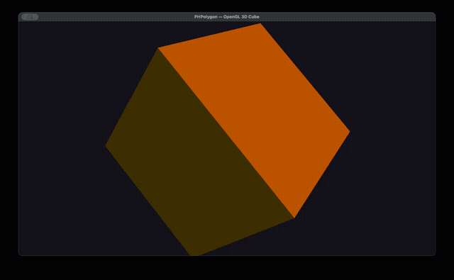
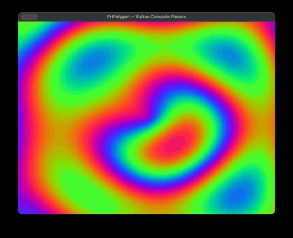
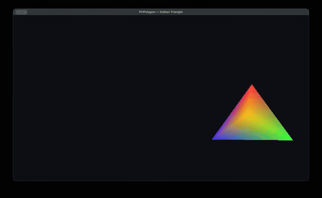

<p align="center">
  
</p>

<p align="center">
  <strong>PHP-native game engine with AI-first authoring</strong>
</p>

<p align="center">
  <a href="#features">Features</a> ·
  <a href="#architecture">Architecture</a> ·
  <a href="#getting-started">Getting Started</a> ·
  <a href="#examples">Examples</a> ·
  <a href="#roadmap">Roadmap</a>
</p>

---

PHPolygon is a standalone game engine written entirely in PHP. It leverages
[php-glfw](https://github.com/mario-deluna/php-glfw) for OpenGL 4.1 / NanoVG
rendering and [php-vulkan](https://github.com/hmennen90/php-vulkan) for 3D
graphics. The primary authoring tool is Claude Code — scenes, components, and
game logic are generated and iterated on through AI-assisted workflows.

## Features

- **Hybrid ECS** — Entities as PHP objects, Components with lifecycle hooks
  (`onAttach`, `onUpdate`, `onDetach`), Systems for cross-entity logic
- **Attribute-driven serialization** — `#[Property]`, `#[Range]`, `#[Hidden]`,
  `#[Serializable]` on component fields, zero manual `toJson()`/`fromJson()`
- **Scene system** — PHP-canonical scene definitions, SceneManager with
  single/additive loading, parent-child entity hierarchy, persistent entities
- **Prefabs** — Reusable entity templates as PHP classes
- **PHP ↔ JSON transpiler** — Bidirectional conversion for the editor pipeline;
  PHP is always the source of truth, JSON is the intermediate format
- **Physics** — RigidBody2D, BoxCollider2D, AABB collision detection + response,
  raycasting, trigger/collision events
- **Input mapping** — Action-based system with named bindings (`jump`, `shoot`)
  instead of raw key codes, axis support for movement
- **Audio** — Pluggable backend interface with AudioSource component
- **Editor infrastructure** — Inspector metadata extraction via Reflection,
  component registry with category grouping, SceneDocument with undo/redo,
  command bus for editor operations
- **Math primitives** — Vec2, Vec3, Mat3, Rect as immutable value objects
- **Rendering** — NanoVG 2D renderer, Camera2D, TextureManager, SpriteSheet

## Architecture

```
PHPolygon\
├── ECS\              Entity, World, Component/System interfaces, Attributes
├── Scene\            Scene, SceneManager, SceneBuilder, Prefabs, Transpiler
├── Component\        Transform2D, SpriteRenderer, RigidBody2D, BoxCollider2D, ...
├── System\           Physics2DSystem, Renderer2DSystem, AudioSystem, InputMapSystem
├── Rendering\        Renderer2D (NanoVG), Camera2D, Texture, Color
├── Runtime\          Window, GameLoop, Input, Clock
├── Physics\          Collision2D, RaycastHit2D
├── Input\            InputMap, InputAction, InputBinding
├── Audio\            AudioBackendInterface, AudioClip
├── Math\             Vec2, Vec3, Mat3, Rect
├── Editor\           Inspector, Registry, Commands, SceneDocument, ProjectManifest
└── Event\            EventDispatcher, scene/collision/trigger events
```

### Design Principles

- **PHP is canonical** — Scenes are PHP classes, version-controlled as code.
  JSON is a derived artefact for editor tooling.
- **Attribute-driven** — Component metadata (`#[Property]`, `#[Range]`,
  `#[Category]`) drives both serialization and editor UI generation.
- **No cross-boundary logic** — Components own per-entity behavior, Systems
  own cross-entity logic. Never mix the two.
- **Layered rendering** — `RenderContextInterface` base, `Renderer2D` for
  NanoVG/OpenGL, future `Renderer3D` for Vulkan with command buffers.

## Getting Started

### Requirements

- PHP 8.2+
- [php-glfw](https://github.com/mario-deluna/php-glfw) extension (OpenGL 4.1 + NanoVG)
- [php-vulkan](https://github.com/hmennen90/php-vulkan) extension (Vulkan rendering)
- Composer

### Installation

```bash
composer require phpolygon/phpolygon
```

### Hello World

```php
<?php

use PHPolygon\Engine;
use PHPolygon\EngineConfig;
use PHPolygon\Component\Transform2D;
use PHPolygon\Component\SpriteRenderer;
use PHPolygon\Math\Vec2;

$engine = new Engine(new EngineConfig(
    title: 'My Game',
    width: 1280,
    height: 720,
));

$engine->onInit(function ($engine) {
    $player = $engine->world->createEntity();
    $player->attach(new Transform2D(position: new Vec2(640, 360)));
    $player->attach(new SpriteRenderer(textureId: 'player.png'));
});

$engine->run();
```

### Scenes

```php
use PHPolygon\Scene\Scene;
use PHPolygon\Scene\SceneBuilder;
use PHPolygon\Component\Transform2D;
use PHPolygon\Component\Camera2DComponent;

class MainMenu extends Scene
{
    public function getName(): string { return 'main_menu'; }

    public function build(SceneBuilder $b): void
    {
        $b->entity('Camera')
            ->with(new Transform2D())
            ->with(new Camera2DComponent(zoom: 1.0));

        $b->entity('Player')
            ->with(new Transform2D(position: new Vec2(100, 200)))
            ->child('Weapon')
                ->with(new Transform2D(position: new Vec2(20, 0)))
                ->with(new SpriteRenderer(textureId: 'sword'));
    }
}
```

## Examples

The `examples/` directory contains runnable demos:

### Hello World — NanoVG 2D Engine



Movable entity with camera, grid background, HUD overlay. WASD controls.

### OpenGL Triangle — Custom Shaders



Rotating RGB triangle with vertex/fragment shaders, pulsing brightness.

### OpenGL 3D Cube — Phong Lighting



Phong-lit spinning cube with camera orbit (WASD), zoom (scroll), depth testing.

### Vulkan Compute — GPU Plasma



Compute shader generates animated plasma pattern, presented via swapchain.

### Vulkan Triangle — 3D Graphics Pipeline



Rotating 3D pyramid with perspective projection, push constants, swapchain presentation.

## Roadmap

| Phase | Description | Status |
|-------|-------------|--------|
| 1 | Engine foundation — ECS, runtime, rendering, math | Done |
| 2 | Scene system — SceneManager, hierarchy, prefabs, transpiler | Done |
| 3 | Game systems — physics, collision, input mapping, audio | Done |
| 4 | Editor infrastructure — inspector, registry, commands | Done |
| 5 | First game — engine validation through real-world usage | Next |
| 6 | Vulkan 3D — Renderer3D, command buffers, 3D pipeline | Planned |

## Testing

```bash
composer install
./vendor/bin/phpunit
```

132 tests, 311 assertions across ECS, math, serialization, scene system,
physics, input, audio, and editor infrastructure.

## License

MIT
